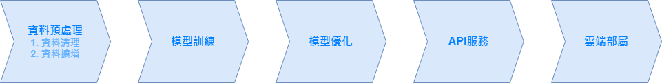
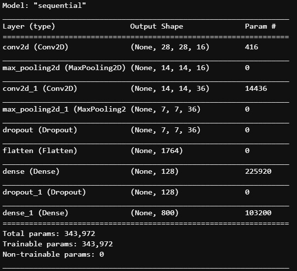
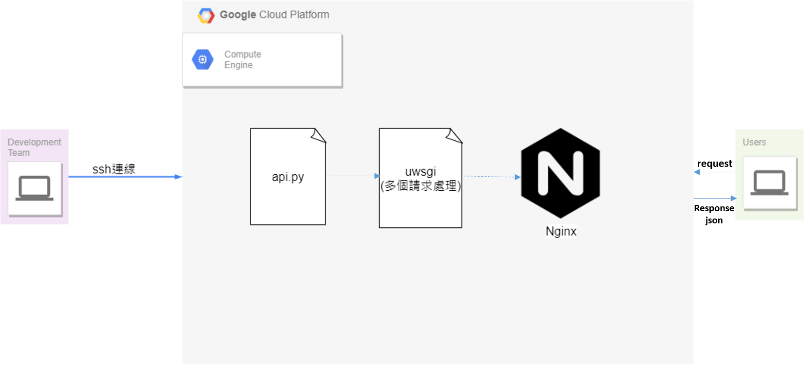

# Esun Bank Chinese Handwrite AI Competition
***將主辦方提供的六萬多張中文圖片透過深度學習模型訓練以達成識別分類***
## 動機
在搜尋有關AI相關資訊時，突然看到ESB的競賽訊息，因此想透過這個中文手寫辨識的競賽機會學習如何將Deep Learning與API 技術相結合，並透過部屬至雲端創造一個整合性服務。
## 設計理念
此次競賽我們使用到的技術有：**CNN+Flask+GCP+uWSGI+Nginx**

* Model的設計：  
  將已處理過的資料圖片結果(資料清洗及資料擴增)，透過CNN準確地辨別出圖片裡的中文字，最終將訓練過後的model與webservice結合回傳至client端。

* API的設計：  
  使用主辦方提供範例程式中的Flask框架(Flask是一個較為容易及快速上手的web service的套件)製作api再加上uwsgi及nginx的技術，避免service撐不住同時處理多個requests。
  
## 簡易步驟流程
由於這次主辦方提供了資料集，我們可以省去資料收集的過程。

將這次的競賽流程分了五個大方向：  



## Detailed Step Process

### Part 1 - 資料預處理

1. 資料清理

   * 將主辦方給的資料重新標記分類(因為會有錯誤的分類)
   * 每一個label挑選出至少25張能辨別的圖片，如果圖片不足25張，利用手寫或者是不同的電腦字型加以補充

2. 資料擴增

   * 將圖片依不同的亮度進行調整
   * 將圖片每旋轉10度進行保存，所以每張原始圖片，至少會擴增36張不同角度的圖

3. 每個label隨機選取五分之一的圖片資料做為測試資料(不訓練)

4. 圖片灰階處理

   ```python
   image = cv2.cvtColor(image, cv2.COLOR_BGR2GRAY)
   ```

5. 圖片與label壓成NPY檔案

6. 資料標準化

   <details>
       <summary>圖片標準化，使其值能更快收斂</summary>
       	<ul>
               <li>將圖片的值除以255</li>
               <li>白化處理</li>
               <li>ZCA處理</li>
           </ul>
   </details>


   <details>
       <summary>Label標準化</summary>
       	<ul>
               <li>One-Hot Encoding</li>
           </ul>
   </details>

7. 補充

   * 可使用waifu2x-ncnn-vulkan工具將圖片清晰化並放大兩倍再進行resize調整

### Part 2 、3- 模型訓練及優化


```python
model=modelBuild()
#定義訓練方式
model.compile(loss='categorical_crossentropy', #設定損失函數，在深度學習中使用cross_enteopy訓練的效果比較好
             optimizer='adam',  #在深度學習中使用adam最優化方法，可以讓訓練更快收斂並提高準確率
             metrics=['accuracy']) #設定評估方法為accuracy準確率 

#開始訓練
train_history=model.fit(x=x_Train4D_normalize, #feature數字影像特徵值
                       y=y_TrainOneHot,        #label數字影像真實的值
                       validation_split=0.2,   #將資料分成80%訓練資料，20%驗證資料
                       shuffle=True,
                       epochs=100,              # 執行100次訓練週期
                       batch_size=50,         #每一批次50筆資料
                       verbose=2)              #0:無顯示 1:進度條顯示 2:顯示訓練過程
```





```python
#評估模型準確度
scores = model.evaluate(x_Train4D_normalize,y_TrainOneHot)

#進行預測
prediction=np.argmax(model.predict(x_Test4D_normalize), axis=-1)
```

\>> predict()：返回值是數值，即該樣本屬於每一個類別的概率 ;  

\>> predict_classes()：返回的是類別的索引，即該樣本所屬的類別標籤

### Part 4 - API 服務

1. Part 4 - API 服務
2. Part 4 - API 服務
3. 將圖片轉換為灰階與標準化
4. 進行預測
5. 將預測結果以json的方式回傳

### Part 5 - 雲端部屬

<details>
    <summary>機器規格</summary>
      <ul>
          <p>雲端部署平台：GCP的 Compute Engine</p>
          <p>機器類型：e2-highmem-8 (8 個 vCPU，64 GB 記憶體)</p>
          <p>OS：ubuntu-1804-bionic-v20210514</p>
     </ul>   
</details>


<details>
    <summary>uWSGI與Nginx</summary>
      <ul>
          <p>uWSGI與Nginx我們是參考以下的網址所建置的，詳細內容請參考：</p>
          <p><a herf='https://www.digitalocean.com/community/tutorials/how-to-serve-flask-applications-with-uswgi-and-nginx-on-ubuntu-18-04'>How To Serve Flask Applications with uWSGI and Nginx on Ubuntu 18.04</a></p>
     </ul>   
</details>


## 整體服務架構




